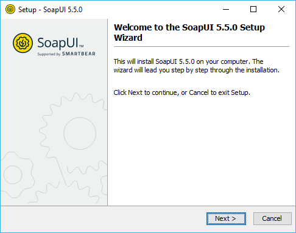
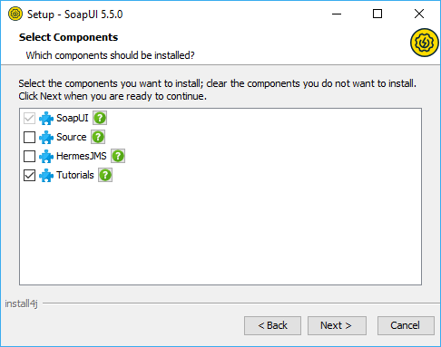
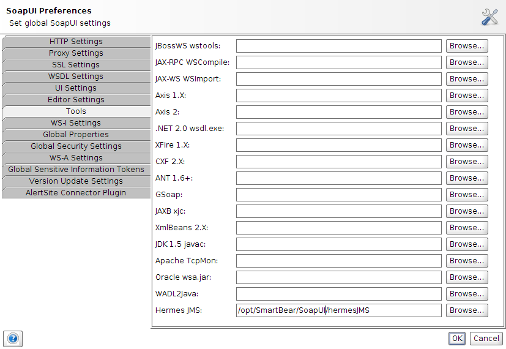
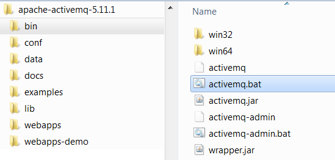

# Introduction aux Tests avec JMS

SoapUI s'intègre avec HermesJMS un projet open source qui supporte plusieurs fournisseurs JMS et permet de recevoir et d'envoyer des messages textuels et binaires depuis et vers des files MQ.

## Intégration de l'outil HermesJMS avec SoapUI

L'intégration de HermesJMS dans SOAPUI se fait soit :

- Au moment de l'installation de SOAPUI

- En installant HermesJMS https://sourceforge.net/projects/hermesjms/

Dans SoapUI aller sous <strong> Preferences > Tools > HermesJMS</strong> et renseigner la localisation de HermesJMS

## Installation de ActiveMQ

ActiveMQ est une implémentation JMS idéale pour mettre en place des tests.

- Télécharger ActiveMQ depuis activemq.apache.org/download.html
- Dézipper le fichier zip
- Ouvrir le répertoire bin

- Ouvrir une commande cmd
- Exécuter la commande <strong>activemq.bat start</strong>

La console d'administration de ActiveMQ est accessible depuis le port 8161 : <strong>http://localhost:8161 </strong> 
Login : <strong>admin</strong>  
Mot de passe : <strong>admin</strong>  

# Documentation
https://www.soapui.org/jms/getting-started.html
